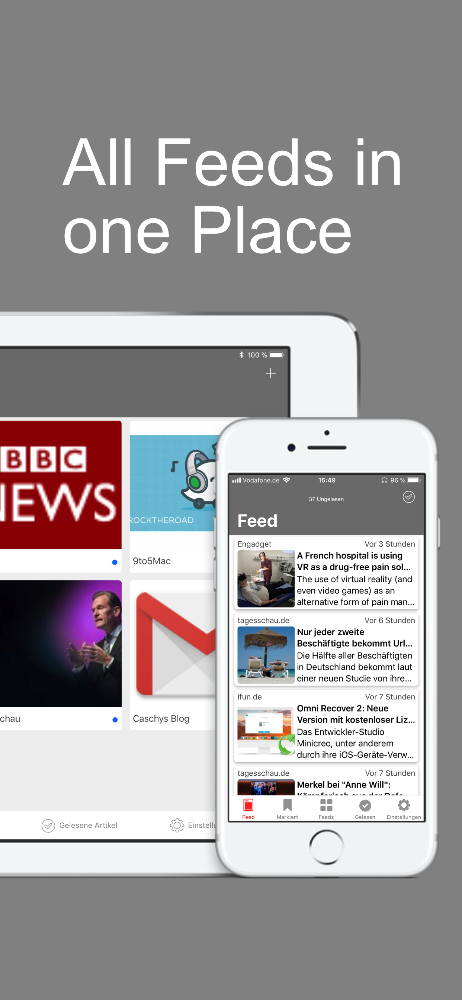
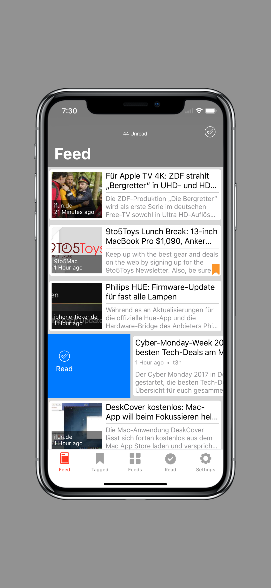
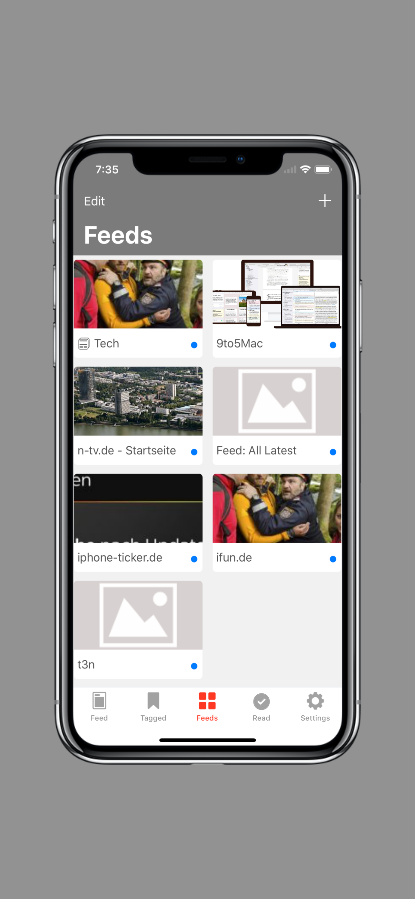

# Simple Feed

## Description

Simple Feed is perfect for anyone who wants to read articles from specific sources and do not want his news feed to be manipulated in any way.
You have the total control about your feed.

<table border="0">
    <tr>
        <td>
            
        </td>
        <td>
            
        </td>
        <td>
            
        </td>
    </tr>
</table>

Simple Feed is basically an RSS-Reader. So you can add feeds from any source you want and get only the news you have subscribed to.

Not only does the app support RSS-Feeds but also Atom-Feeds. So you are able to follow a wide range of feeds publishers worldwide. You only have to search for the publisher in the app or go onto the publisher's site and search for the RSS-Icon or the feed url.

**Features**
- Subscribe to RSS and Atom feeds
- Search for feeds
- Clean Feed with only unread yrticles
- Mark articles
- Share articles
- 3D Touch Support
- Create feed groups
